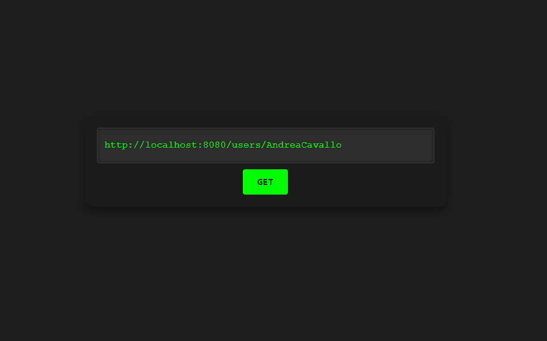

# Andrea Cavallo Portfolio

This is the personal portfolio website of Andrea Cavallo, a software developer with a background in mechanical engineering. The website showcases my skills, experiences, and projects in the field of software development.

## Project Structure

- `index.html`: The main HTML file that contains the structure of the website.
- `styles/style.css`: The CSS file that contains the styling of the website.
- `scripts/script.js`: The JavaScript file that contains the interactive functionality of the website.

## Features

- **Typed.js Integration**: Animated typing effect for the description section.
- **Responsive Design**: The website is optimized for both desktop and mobile devices.
- **Interactive UI**: Button to toggle the display of the main content.

## Project Structure

```text
/json-portfolio-backend
├── /images
│   ├── demo1.png
│   └── demo2.png
├── index.html
├── styles
│   └── style.css
├── scripts
│   └── script.js
└── README.md
```

## Setup

To set up and run this project locally, follow these steps:

Clone the repository:
   ```sh
   git clone https://github.com/Andrea-Cavallo/json-portfolio-backend.git
  ```

Navigate to the project directory:
   ```sh
cd json-portfolio-backend
   ```

Open index.html in your preferred web browser.


## Demo
Here are some screenshots of the website:


then --->


## License

This project is licensed under the MIT License - see the LICENSE file for detail

## Contact
You can reach me at a.cavallo@outlook.it.

